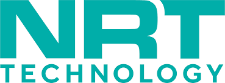

# FinTech Case Study

## Overview and Origin
NRT Technology was founded in 1984 and launched in 1993 by John Dominelli, an engineer with more than four decades of experience in the gaming and retail technology industries, a visionary leader credited with several inventions that have dramatically changed the technology landscape. NRT has become one of the most innovative gaming technology solutions in the world. John's original goal was point-of-sale (POS) services for the North American market and delivering pieces and part solutions for POS devices. NRT is a privately held for profit corporation that serves a multitude of customers such as Mohegan Sun, Boyd Gaming Corporation, MGM Resorts International, Casino Niagara, Caesars Entertainment, Las Vegas Sands Corp., Genting Group and Wynn Resorts and processes more than $20 billion of ATM and POS transactions every year.
## Business Activities:
NRT Technology provides software solutions, develops enterprise payment systems, digital table game platforms, big data analytics, and credit marker information solutions. NRT Technology also offers payment processing and cash management services. NRT Technology serves casinos, lotteries, banks, retailers, and ATM operators worldwide.
## Landscape:
* What domain of the financial industry is the company in?
  - Payment Processing
* What have been the major trends and innovations of this domain over the last 5-
10 years?
  - Play+
  - Lilly
* What are the other major companies in this domain?
  - IGT
  - Global Payments
  - Everi
## Results
* What has been the business impact of this company so far?
* What are some of the core metrics that companies in this domain use to measure
success? How is your company performing, based on these metrics?
* How is your company performing relative to competitors in the same domain?
## Recommendations
* If you were to advise the company, what products or services would you suggest
they offer? (This could be something that a competitor offers, or use your
imagination!)
* Why do you think that offering this product or service would benefit the
company?
* What technologies would this additional product or service utilize?
* Why are these technologies appropriate for your solution?
### Resources
https://www.nrttech.com/
https://www.linkedin.com/company/nrttechnology/
